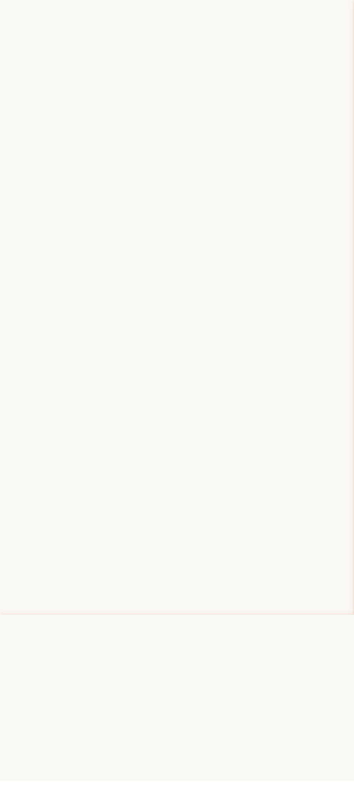

# IPL 2026 Fantasy Predictor

**186 players. 7 friends. 1 question: who drafted the best team?**

We built a prediction engine to settle our fantasy IPL draft before a single ball is bowled. It scrapes official IPL stats, researches player availability from news sources, and runs every player through a prediction model to forecast the season.

**[See the live predictions](https://tinyurl.com/7xf8zxj7)**

<p align="center">
  
</p>

## What It Does

Each of the 186 players in our draft gets a predicted points total based on their batting runs, bowling wickets, likelihood of making the Playing XI, and availability for the season. Those individual predictions roll up into owner totals to produce a final leaderboard.

Click into any owner to see their full squad breakdown — which players are carrying the team, how points split between batting and bowling, and which IPL franchises they're most exposed to.

<p align="center">
  
</p>

Drill into any player to see exactly how their prediction was calculated — career stats, recent form, playing XI tier, and the full formula breakdown.

## Scoring

Dead simple: **1 run = 1 point, 1 wicket = 25 points.** No bonuses, no strike rate, no catches. League stage only (14 matches per team).

## How Predictions Work

### The Formula

```
Expected Points = Expected Matches × (Runs/Match + Wickets/Match × 25)
Expected Matches = 14 × Playing XI % × Availability
```

### Stats: Weighted by Recency

Player stats are blended across three time windows — 50% IPL 2025, 30% IPL 2024, 20% career average. Recent form matters most in T20 cricket. If a player is missing a season, the weights redistribute across what's available.

### Playing XI Tiers

Not every player makes the team sheet. Each player is classified into one of four tiers based on their role, franchise status, and overseas slot competition:

| Tier | Probability | Who |
|------|------------|-----|
| Locked In | 92% | Captains, franchise stars |
| Likely | 75% | First-choice, may rotate |
| Fringe | 40% | Competing for a spot |
| Bench | 10% | Deep squad |

### Availability

Reduced only for player-specific evidence — injury, international duty, late joining. Assessed via analysis of multiple news sources with full audit trails.

### Debutants

16 players with no IPL history get conservative baseline estimates by role (e.g. batter: 15 runs/match, bowler: 0.5 wickets/match).

## Data Sources

All batting and bowling statistics come from the **official IPL player feeds** at iplt20.com. Lineup probability and availability assessments are researched from official IPL/BCCI sources and reputable cricket reporting, with structured validation.

Every non-stats field (playing XI tier, availability, overseas competition) has a full audit trail — basis, sources, timestamps, and confidence ratings.

## What's Not Modeled

Venue effects, head-to-head matchups, toss, position changes, and the Impact Player rule. Over 14 matches these tend to even out.

## Tech Stack

**Backend:** Python — stats fetching from official IPL feeds, automated research for lineup/availability, prediction model

**Frontend:** Next.js, React, TypeScript, Tailwind CSS, Recharts — deployed on Vercel

## Project Structure

```
├── model.py                 # Prediction engine
├── player_registry.csv      # Canonical data (186 players × 150+ columns)
├── collect_data.py          # CSV → model adapter
├── run_predictions.py       # Generates predictions
├── build_frontend_data.py   # Predictions → frontend JSON
├── official_ipl.py          # IPL data fetching
├── fetch_player_data.py     # Official stats fetcher
├── enrich_non_stats.py      # Lineup/availability research
├── grounded_research.py     # Research client & validation
├── repair_availability.py   # Availability data repair
├── verification/            # Data quality & sanity checks
├── ipl-fantasy-site/        # Next.js frontend app
└── data/raw/                # Raw data artifacts & audit trails
```

---

*Built for bragging rights. Not financial advice.*
